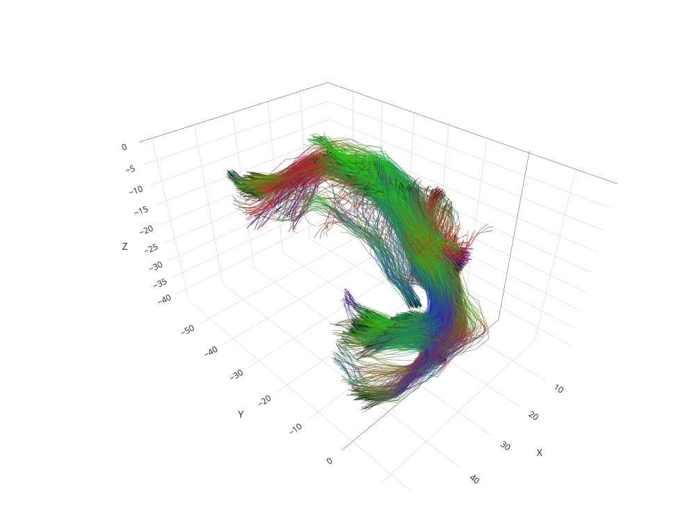

<!-- README.md is generated from README.Rmd. Please edit that file -->

# `rtists`

<!-- badges: start -->

[](https://github.com/astamm/rtists/actions)
[](https://github.com/astamm/rtists/actions)
[](https://app.codecov.io/gh/astamm/rtists?branch=master)
[](https://github.com/astamm/rtists/actions)
[](https://CRAN.R-project.org/package=rtists)

<!-- badges: end -->

The goal of `rtists` is to provide visualization tools for tissue
integrity superimposed on tractography streamlines.

## Installation

You can install the development version of `rtists` from
[GitHub](https://github.com/) with:

``` r
# install.packages("devtools")
devtools::install_github("astamm/rtists")
```

## Example

The following code generates a basic 3D visualisation of the left
uncinate fasciculus:

``` r
library(rtists)
library(future)
plan(multisession)
out <- autoplotly::autoplotly(uf_left)
ℹ Displaying 2042 streamlines...
ℹ Coloring streamlines by orientation...
plan(sequential)
```

[](https://astamm.github.io/rtists/articles/rtists.html)
